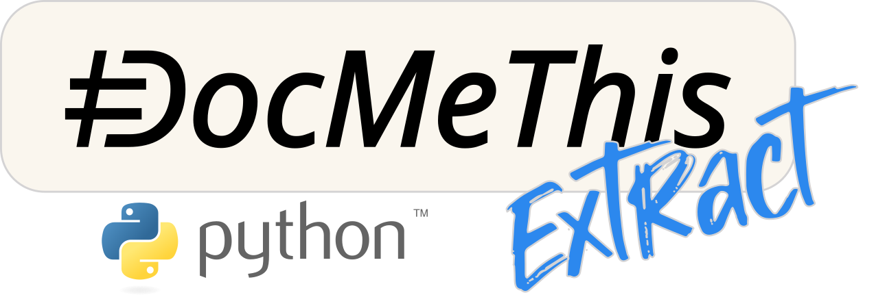

<p align="center">
  <a href="https://docmethis.com">
    <picture>
      
    </picture>
  </a>
</p>

<p align="center">
  <em>DocMeThis Extract Python is a <a href="https://docmethis.com">DocMeThis</a> project, part of the <a href="https://github.com/orgs/DocMeThis/repositories">DocMeThis suite</a>.</em>
</p>

# DocMeThis Extract Python

[](LICENSE)

**Turn Python source into structured code facts.**

`docmethis-extract-python` is a Python extraction layer published by DocMeThis. 
It discovers Python source files, parses them with the standard AST,
and produces structured records for downstream verification and CI tooling.

```text
Python project
    -> source discovery + AST extraction
        -> enriched module, class and function records
            -> Verify facts + Check analysis
                -> JSON report + CI annotations
```

## What It Provides

- **AST-based:** extracts source facts without importing the analyzed project.
- **Location-aware:** preserves qualified names, source paths and line ranges.
- **Contract-ready:** records signatures, parameters, annotations, docstrings,
  visibility and return information.
- **Behavior-aware:** captures complexity, I/O effects, raised exceptions and
  observable properties.
- **Relationship-aware:** builds inheritance information and a best-effort
  callgraph with recursion and depth analysis.
- **Test-aware:** can link test references, coverage, direct calls and usage
  examples to production functions.
- **Cacheable:** reuses `.docmethis_cache.json` and supports full reanalysis.
- **Serializable:** exports a versioned `ProjectRecord` JSON representation.
- **Service-free:** does not require an API key or an external DocMeThis service.

## How It Works

1. Discover Python files recursively below the project root and apply packaged
   and project-specific exclusions.
2. Parse uncached files into module, class and function records.
3. Enrich the records with signatures, types, complexity, I/O, exceptions,
   imports, inheritance and callgraph information.
4. When dynamic analysis is enabled, run the project's detected pytest or
   unittest suite in an isolated subprocess and map available coverage and calls.
5. Return a `ProjectRecord` that can be consumed directly or serialized to JSON.

Static extraction does not execute application imports. The default complete
analysis may run the analyzed project's tests; use the Python API with
`skip_dynamic=True` when only static facts are required.

## Quick Start: Python MVP

### Installation

The public MVP requires Python 3.12+:

```bash
python3.12 -m venv .venv
. .venv/bin/activate
python -m pip install docmethis-extract-python
```

On Windows, activate the environment with `.venv\Scripts\Activate.ps1`.

### Local CLI

Analyze a Python project and print its quality summary:

```bash
python -m docmethis_extract_python /path/to/project
```

The CLI discovers the project, uses the cache when available, and performs the
complete analysis. Force a fresh extraction and enable detailed logs with:

```bash
python -m docmethis_extract_python /path/to/project \
  --full-reanalysis \
  --verbose
```

The CLI writes the cache to `.docmethis_cache.json` in the analyzed project and
prints a summary containing analyzed files, cache hits, parse errors, functions
and classes. It does not write source files or a JSON report; use the Python API
below for structured serialization.

### Python API

The stable downstream API lives under `docmethis_extract_python.api`:

```python
from pathlib import Path

from docmethis_extract_python.api import analyze_project, iter_functions, serialize_project

project = analyze_project(Path("."), skip_dynamic=True)

for function in iter_functions(project.modules):
    print(function.qualified_name, function.visibility.value)

Path("docmethis-extract.json").write_text(
    serialize_project(project),
    encoding="utf-8",
)
```

For the complete pipeline, omit `skip_dynamic=True`. The extractor detects
pytest or unittest in the analyzed environment, runs the suite in a subprocess,
and adds coverage, failing-test and call information when the required tools
are available. If no test framework is detected, dynamic execution is skipped.

## Configuration

The extractor reads `[tool.docmethis]` from the analyzed project's
`pyproject.toml`. Packaged defaults exclude virtual environments, VCS metadata,
build artifacts, caches, vendored code and generated protobuf files. Add project
specific exclusions or tune mixin detection as needed:

```toml
[tool.docmethis]
exclude_patterns = ["generated/", "fixtures/"]
mixin_max_methods = 8
```

Directory patterns ending in `/` match path components. Other patterns match
file names. CLI `--full-reanalysis` is an execution option and ignores the
cache for that run.

## Extracted Model

The public root package exposes the core record types:

| Export | Purpose |
| --- | --- |
| `ModuleRecord` | A discovered Python module and its source facts |
| `ClassRecord` | A class, its hierarchy and methods |
| `FunctionRecord` | A function or method with progressive analysis fields |
| `ProjectRecord` | The complete project-level result |
| `Confidence` | Confidence of an extracted or inferred field |
| `Provenance` | Origin of a field, such as annotation, test or callgraph |
| `Visibility` | Public, protected or private visibility |
| `MethodType` | Function, instance method, class method, static method or property |
| `ParameterType` | Python parameter kind from the signature |

The broader inter-package surface in `docmethis_extract_python.api` also
provides configuration loading, module extraction, callgraph construction,
function iteration, import traversal and JSON serialization helpers.

`serialize_project()` emits a JSON object with `schema_version = 2`.
`deserialize_project_record()` reconstructs a `ProjectRecord` from that
representation:

```python
import json

from docmethis_extract_python.api import deserialize_project_record, serialize_project

serialized_json = serialize_project(project)
restored = deserialize_project_record(json.loads(serialized_json))
```

## Current Python Coverage

| Boundary | Public MVP |
| --- | --- |
| Runtime | Python 3.12+ |
| Sources | `.py`, `.pyw`, `.pyi` |
| Static facts | Modules, symbols, signatures, types, imports, effects and relationships |
| Dynamic facts | pytest or unittest references, coverage, calls and examples when available |
| Output | Python records and versioned JSON |
| Consumers | `docmethis-verify`, `docmethis-check` and other adapters |

The extractor captures existing docstrings as source facts. It does not parse
NumPy or other documentation formats; that responsibility belongs to
`docmethis-verify`.

## What It Does Not Do

- Validate documentation claims. Use [DocMeThis Verify](https://github.com/DocMeThis/docmethis-verify).
- Select changed or affected symbols. Use [DocMeThis Check](https://github.com/DocMeThis/docmethis-check).
- Generate documentation or rewrite source files.
- Produce CI annotations or assign diagnostic severity.
- Call an LLM, Gateway or external DocMeThis service.
- Guarantee complete resolution of dynamic Python behavior; callgraph and type
  inference remain best-effort static analyses.

## DocMeThis Ecosystem

Extract is the source-facts layer of the public Python path:

```text
Python source
    -> docmethis-extract-python
        -> docmethis-verify
            -> docmethis-check
                -> JSON report + CI annotations
                    -> DocMeThis Fix
                        -> targeted documentation patch
                            -> review + CI verification
```

Extract and Verify are separate packages so language-specific source adapters
and documentation-format adapters can evolve without changing the consumer
workflow.

[Explore the full DocMeThis platform](https://docmethis.com), or follow the
[DocMeThis organization on GitHub](https://github.com/DocMeThis).

## Development

```bash
uv sync --dev --locked
uv run pre-commit install --hook-type pre-commit --hook-type pre-push
uv run ruff check
uv run ruff format --check
uv run pytest -q
uv build
```

The test suite includes the public import boundary, record serialization,
static extraction passes, callgraph and inheritance analysis, and dynamic test
integration cases.

## License

DocMeThis Extract Python is available under the [DocMeThis Source-Access License](LICENSE).
The source is public, but permission is limited to personal or internal
organizational use and excludes third-party services or work. The DocMeThis logo
is separately copyrighted; see
[`branding/README.md`](branding/README.md).
